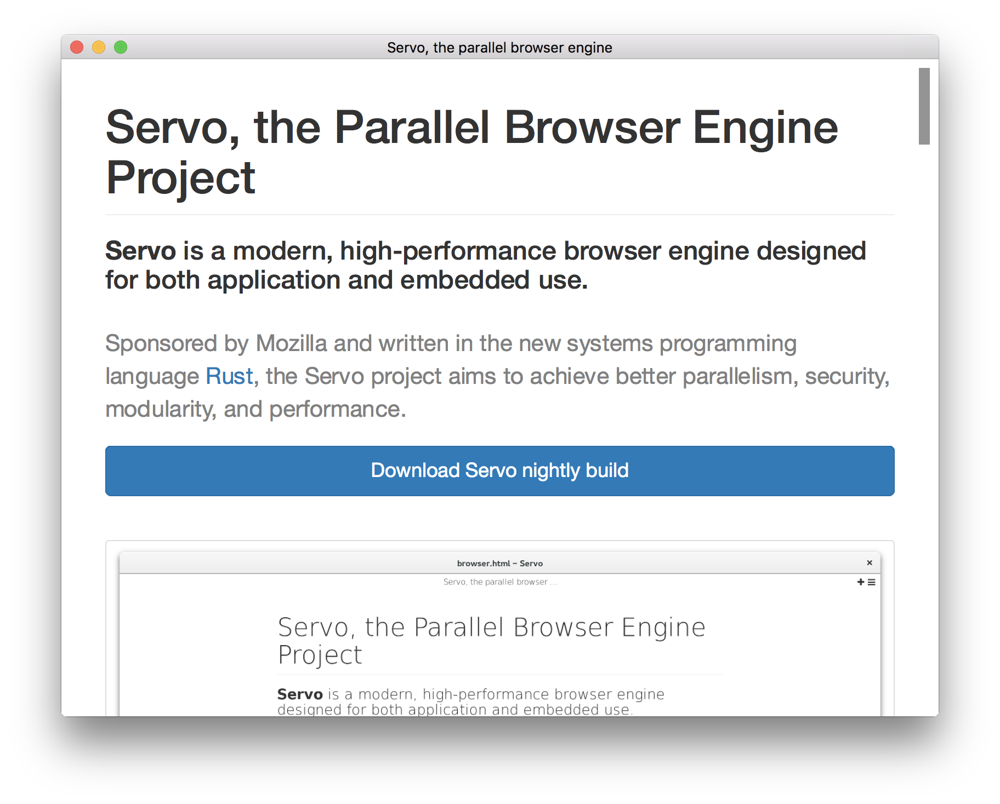
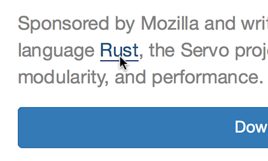
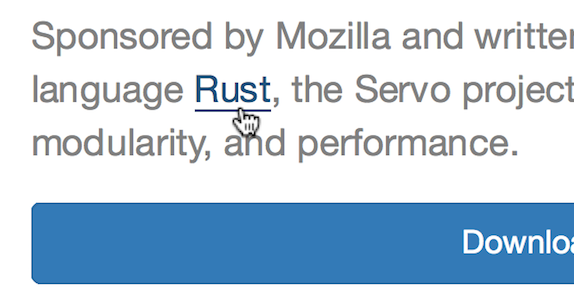

Tutorial: Embedding Servo
=========================

This document describes how to use Servo in a third party Rust project.
It comes with the implementation of standalone minimal browser.

This repository [paulrouget/servo-embedding-example](http://github.com/paulrouget/servo-embedding-example)
is regularly updated to match the must recent Servo version.

Servo documentation: [doc.servo.org](https://doc.servo.org).

Servo type entry point: [doc.servo.org/servo/struct.Servo.html](https://doc.servo.org/servo/struct.Servo.html).

## Warning

The Servo embedding API is still work-in-progress. It is functional but not polished. Some cosmetic changes are planned. See [this issue](https://github.com/servo/servo/issues/18479).

This tutorial does not cover how to build on Windows as it is far from being straight forward for now as it requires importing and tweaking multiple python script from Servo. See [servo/servo#18343](http://github.com/servo/servo/issues/18343) and [paulrouget/servoshell#33](http://github.com/paulrouget/servoshell/issues/33).

It doesn't not cover all the features we would find in a full-featured browser. A more complete example of a Servo-based browser can be found here: [paulrouget/servoshell](http://github.com/paulrouget/servoshell).

## Overview

To embed Servo, we need to:

1. compile Servo as a dependency
2. provide OpenGL context with its OpenGL methods
3. implement a set callbacks (servo-to-embedder communication) by implementing the `WindowMethods` trait:
   1. to provide coordinates of the OpenGL buffer,
   2. to wake-up the event loop,
   3. to update the OpenGL buffer,
   4. to be notified of page navigations,
4. send events to servo (embedder-to-servo communication) by sending `WindowEvent`s to servo:
   1. to create and select browsers,
   2. to enable mouse and keyboard interactions,
   3. to control page navigation,

In this tutorial we will go through each steps.

## Create Rust project

[Install rustup](https://www.rustup.rs/) and make sure to install all the Servo dependencies
[as described here](https://github.com/servo/servo#setting-up-your-environment).

Initialize your project:

* `cargo init --bin --name servo-embedding-example`

We recommend cloning the servo repository as we will need to copy some files to our project. In a parallel directory:

* `git clone https://github.com/servo/servo.git`

## Installing the proper Rust toolchain

As for now, Servo requires Rust Nightly.

Import the `rust-toolchain` file from the servo directory to make sure we use the same `rustc` version:

* `cp ../servo/rust-toolchain .`
* `` rustup install `cat rust-toolchain` ``

Note: this will change. [See this issue](https://github.com/paulrouget/servoshell/issues/37).

## libservo

Add Servo as a dependency to your `Cargo.toml`:

```toml
[dependencies]
libservo = { git = "https://github.com/servo/servo", rev = "XXXXXXXXXX" }
```

Replace `XXXXXXXXXX` with the commit hash of Servo HEAD. For example: `75a4dcf`.

Because we are importing some files from the servo repository directly (`rust-toolchain`, and as we will see later, `Cargo.lock` and `resources`) and because Servo is not versionned yet, it is necessary to specify servo's revision hash (with `rev = …`).

If you'd rather use a local copy of Servo, do not point to the root of the servo directory but to `components/servo`:

```toml
[dependencies]
libservo = { path = "../servo/components/servo" }
```

Servo requires some specific version of its dependencies. It is highly recommended to import Servo's `Cargo.lock`:

* `cp ../servo/Cargo.lock .`

Note: this will change. [See this issue](https://github.com/paulrouget/servoshell/issues/36).

Servo also requires some "resources" files to run properly:

* `cp -r ../servo/resources .`

Note: this will change. [See this issue](https://github.com/paulrouget/servoshell/issues/38).

## Update servo

In this example, we depend on a specific version of Servo. When you want to update Servo to a more recent version, do:

1. change the revision in `Cargo.toml` (the `rev` field)
2. Copy `rust-toolchain`, `Cargo.log` and `resources` from Servo

## OpenGL

The first thing Servo requires is access to OpenGL functions, as described by [the gleam::gl::Gl trait](http://doc.servo.org/gleam/gl/trait.Gl.html).

It's up to the embedder to create and update the OpenGL buffer.

In this tutorial, we will use the [Glutin crate](https://crates.io/crates/glutin) to create the OpenGL context. Glutin is a library which provides cross-platform methods to open native windows with a full-window OpenGL buffer.

```toml
# Cargo.toml
glutin = "0.9"
```

## Building

At this point, we should be able to build our project.

Minimal code:

```rust
extern crate servo;

fn main() {
    println!("Servo version: {}", servo::servo_version());
}
```

Run the project:

```shell
cargo build --release
cargo run --release
```

Notice that `Cargo.lock` has been updated.

## Glutin's event loop

Now let's open an empty window and run the Glutin event loop (this code has nothing to do with Servo just yet). See [Glutin documentation](https://docs.rs/glutin/) for more details.

```rust
extern crate servo;
extern crate glutin;

fn main() {
    println!("Servo version: {}", servo::config::servo_version());

    let mut event_loop = glutin::EventsLoop::new();

    let builder = glutin::WindowBuilder::new().with_dimensions(800, 600);
    let gl_version = glutin::GlRequest::Specific(glutin::Api::OpenGl, (3, 2));
    let context = glutin::ContextBuilder::new().with_gl(gl_version).with_vsync(true);
    let window = glutin::GlWindow::new(builder, context, &event_loop).unwrap();
  
    window.show();

    event_loop.run_forever(|_event| {
        glutin::ControlFlow::Continue
    });
}
```

## EventLoopWaker: mechanism to wake up the event loop

Servo internals and the embedder code will run in different threads. Usually, the embedder will have an event loop that will block when no user events happen. Servo will need a way to wake up the event loop from a different thread when needed (to update the OpenGL buffer for example, or notify the embedder of any navigation changes). It's up to the embedder to provide such a mechanism, by providing a thread-safe object that implements the [`EventLoopWaker`](http://doc.servo.org/compositing/compositor_thread/trait.EventLoopWaker.html) trait.

In our example, we will use Glutin's [EventLoopProxy](https://docs.rs/glutin/0.9.2/glutin/struct.EventsLoopProxy.html#method.wakeup) to wake up the event loop.

```rust
use std::sync::Arc;
use servo::compositing::compositor_thread::EventLoopWaker;

pub struct GlutinEventLoopWaker {
    pub proxy: Arc<glutin::EventsLoopProxy>
}

impl EventLoopWaker for GlutinEventLoopWaker {
    // Use by servo to share the "event loop waker" across threads
    fn clone(&self) -> Box<EventLoopWaker + Send> {
        Box::new(GlutinEventLoopWaker { proxy: self.proxy.clone() })
    }
    // Called by servo when the main thread needs to wake up
    fn wake(&self) {
        self.proxy.wakeup().expect("wakeup eventloop failed");
    }
}


fn main() {
    // […]
    let mut event_loop = glutin::EventsLoop::new();
    // Will be use used by Servo later
    let event_loop_waker = Box::new(GlutinEventLoopWaker {
        proxy: Arc::new(event_loop.create_proxy())
    });
    // […]
}
```

## Retrieving OpenGL context

To provide access to the OpenGL context methods, we will use Glutin's [`get_proc_address`](https://docs.rs/glutin/0.9.2/glutin/trait.GlContext.html#tymethod.get_proc_address) to initialize the OpenGL binding:

```rust
use servo::gl;
use glutin::GlContext;

// […]
let gl = unsafe {
	window.context().make_current().expect("Couldn't make window current");
	gl::GlFns::load_with(|s| window.context().get_proc_address(s) as *const _)
};
// […]
```

--------

At this point, we managed to:

* compile our project with `libservo`
* open an empty window
* have a mechanism (`GlutinEventLoopWaker`) to wake the event loop
* have an object (`gl`) that implements `gl::Gl`

The next step is to initialize Servo and implement its callbacks.

## Configure Servo

http://doc.servo.org/servo_config/opts/struct.Opts.html

Servo can be configured with different options. It is also necessary to set the path of the `resources` directory we copied earlier.

``` rust
use servo::servo_config::resource_files::set_resources_path;
use servo::servo_config::opts;

let path = env::current_dir().unwrap().join("resources");
let path = path.to_str().unwrap().to_string();
set_resources_path(Some(path));

let mut opts = opts::default_opts();
opts::set_defaults(opts);
```

## the `Servo` type

[`Servo`](http://doc.servo.org/servo/struct.Servo.html) is the entry point to create browsers and send events to Servo's internals.

Initiliazing Servo (via
[Servo::new](http://doc.servo.org/servo/struct.Servo.html#method.new)) requires an
object that implements the `WindowMethods`.

## Implement WindowMethods

http://doc.servo.org/compositing/windowing/trait.WindowMethods.html

The `WindowMethods` trait describes a set of methods the embedder must implement.

```rust
use servo::compositing::windowing::WindowMethods;
use std::rc::Rc;

struct Window {
    // All these fields will be used in WindowMethods implementations
    glutin_window: glutin::GlWindow,
    waker: Box<EventLoopWaker>,
    gl: Rc<gl::Gl>,
}

// […]

let window = Rc::new(Window {
    glutin_window: window,
    waker: event_loop_waker,
    gl: gl,
});

let mut servo = servo::Servo::new(window.clone());

// […]

impl WindowMethods for Window {
    // […]
}

```

These callbacks are used by Servo, to:

#### retrieve the event loop waker

via `create_event_loop_waker()`.

#### get and set drawing area coordinates

via `framebuffer_size()` `window_rect()` `size()` …

These methods are used by Servo to get the size, position and pixel density of
the window. For example when a website use `window.outerWidth`. Also used to
calculate the layout of the page.

`set_inner_size()` `set_position()`…

Used to resize and move the native window. When a website use `window.moveTo()` for example.

#### OpenGL operations

These methods are used to update the pixels on the screen. `present()` is called when the OpenGL buffer is ready to be painted. Usually, by swapping the OpenGL buffers. `prepare_for_composite()` is called before compositing. It's useful when multiple buffers are present. Usually, it's when the OpenGL needs to be made current.

#### Navigation callbacks

`load_start` `load_end` `head_parsed` `history_changed`…

These methods are used to inform the embedder of the status of the current web page. For example, these are usuful to update a spinner when the page is loading or update the title and the url of the tab, when the user clicks on a link.

Minimal implementation:

```rust
use servo::euclid::{Point2D, ScaleFactor, Size2D, TypedPoint2D, TypedRect, TypedSize2D};
use servo::ipc_channel::ipc;
use servo::net_traits::net_error_list::NetError;
use servo::script_traits::LoadData;
use servo::servo_geometry::DeviceIndependentPixel;
use servo::servo_url::ServoUrl;
use servo::style_traits::DevicePixel;
use servo::style_traits::cursor::Cursor;
use servo::msg::constellation_msg::{Key, KeyModifiers};

// […]

impl WindowMethods for Window {
    fn prepare_for_composite(&self, _width: usize, _height: usize) -> bool {
        true
    }

    fn present(&self) {
        self.glutin_window.swap_buffers().unwrap();
    }

    fn supports_clipboard(&self) -> bool {
        false
    }

    fn create_event_loop_waker(&self) -> Box<EventLoopWaker> {
        self.waker.clone()
    }

    fn gl(&self) -> Rc<gl::Gl> {
        self.gl.clone()
    }

    fn hidpi_factor(&self) -> ScaleFactor<f32, DeviceIndependentPixel, DevicePixel> {
        ScaleFactor::new(self.glutin_window.hidpi_factor())
    }

    fn framebuffer_size(&self) -> TypedSize2D<u32, DevicePixel> {
        let (width, height) = self.glutin_window.get_inner_size().unwrap();
        let scale_factor = self.glutin_window.hidpi_factor() as u32;
        TypedSize2D::new(scale_factor * width, scale_factor * height)
    }

    fn window_rect(&self) -> TypedRect<u32, DevicePixel> {
        TypedRect::new(TypedPoint2D::new(0, 0), self.framebuffer_size())
    }

    fn size(&self) -> TypedSize2D<f32, DeviceIndependentPixel> {
        let (width, height) = self.glutin_window.get_inner_size().unwrap();
        TypedSize2D::new(width as f32, height as f32)
    }

    fn client_window(&self, _id: BrowserId) -> (Size2D<u32>, Point2D<i32>) {
        let (width, height) = self.glutin_window.get_inner_size().unwrap();
        let (x, y) = self.glutin_window.get_position().unwrap();
        (Size2D::new(width, height), Point2D::new(x as i32, y as i32))
    }

    fn set_page_title(&self, _id: BrowserId, _title: Option<String>) {
        self.glutin_window.set_title(match title {
            Some(ref title) => title,
            None => "",
        });
    }

    fn allow_navigation(&self, _id: BrowserId, _url: ServoUrl, chan: ipc::IpcSender<bool>) {
        chan.send(true).ok();
    }

    fn set_inner_size(&self, _id: BrowserId, _size: Size2D<u32>) {
    }

    fn set_position(&self, _id: BrowserId, _point: Point2D<i32>) {
    }

    fn set_fullscreen_state(&self, _id: BrowserId, _state: bool) {
    }

    fn status(&self, _id: BrowserId, _status: Option<String>) {
    }

    fn load_start(&self, _id: BrowserId) {
    }

    fn load_end(&self, _id: BrowserId) {
    }

    fn load_error(&self, _id: BrowserId, _: NetError, _url: String) {
    }

    fn head_parsed(&self, _id: BrowserId) {
    }

    fn history_changed(&self, _id: BrowserId, _entries: Vec<LoadData>, _current: usize) {
    }

    fn set_cursor(&self, _cursor: Cursor) {
    }

    fn set_favicon(&self, _id: BrowserId, _url: ServoUrl) {
    }

    fn handle_key(&self, _id: Option<BrowserId>, _ch: Option<char>, _key: Key, _mods: KeyModifiers) {
    }
}

```

Note: this will change. [See this issue](https://github.com/paulrouget/servoshell/issues/39).

## Creating a browser

Now we have the callbacks in place, it's time to create the first browser. A browser, also known as a top level browsing context, can be seen as a "tab". It is identified by a `BrowserId`, which is an alias to `TopLevelBrowsingContextId`. Multiple browsers can be instanciated. Only one can be displayed at a time, unless multiple compositor are created (see [this issue](https://github.com/servo/servo/issues/13993)).

So far, we've seen how servo talks back to the embedder. To communicate to servo, we use [`WindowEvent`](http://doc.servo.org/compositing/windowing/enum.WindowEvent.html)s. The two events we are interested in now are `CreateBrowser`and `SelectBrowser`.

`CreateBrowser` will build a new browser and, once ready, send back its `BrowserId` via a [ipc channel](https://doc.servo.org/ipc_channel/index.html). Once received, we use `SelectBrowser` to ask servo to paint that specific browser.

```Rust
let url = ServoUrl::parse("https://servo.org").unwrap();
let (sender, receiver) = ipc::channel().unwrap();
servo.handle_events(vec![WindowEvent::NewBrowser(url, sender)]);
let browser_id = receiver.recv().unwrap();
servo.handle_events(vec![WindowEvent::SelectBrowser(browser_id)]);
```
## Drawing the browser

At this point, almost everything is in place.

If we run the current code, we will only see a white screen. At the moment, servo needs to be notified when to process events from its internal components, and from the embedder.

Note: this will change. [See this issue](https://github.com/servo/servo/issues/15734#issuecomment-328799888).

An empty call to `handle_events` will do.

```Rust
event_loop.run_forever(|event| {
  // Blocked until user event or until servo unblocks it
  match event {
    // This is the event triggered by GlutinEventLoopWaker
    glutin::Event::Awakened => {
      servo.handle_events(vec![]);
    },
    _ => {
    }
  }
  glutin::ControlFlow::Continue
});
```

At this point, the web page should be painted.



Notice that the window title says "Servo, the parallel browser engine". The title has been update via the `WindowMethod::set_page_title` callback we implemented earlier.

## Sending events to servo

As you can notice, user inputs have no effects on the page. Scrolling, clicks or keyboard inputs are not sent to servo yet. In our example, user events come from Glutin, and need to be sent to Servo via `handle_events(Vec<WindowEvent>)`. WindowEvents are use for embedder-to-servo communication. All the events are described in windowing.rs:

https://doc.servo.org/compositing/windowing/enum.WindowEvent.html

We already used two `WindowEvent`: `CreateBrowser` and `SelectBrowser`.

In this tutorial, we will implement mousemove events, cursor update, and scrolling.

## Mouse coordinates and cursor update

This is a good way to show the two-ways communication mechanism between servo
and the embedder. As the mouse moves, the embedder needs to send the pointer
coordinates to servo, and as the pointer moves, servo might request the
embedder to change its cursor (when hovering a link for example).

We catch the Glutin event, translate it into a Servo event, and send it to
Servo. We save the pointer position as we will need it later for scrolling.

```rust
event_loop.run_forever(|event| {
  // Blocked until user event or until servo unblocks it
  match event {
    glutin::Event::WindowEvent {event: glutin::WindowEvent::MouseMoved{position: (x, y), ..} , ..} => {
      pointer = (x, y);
      let event = WindowEvent::MouseWindowMoveEventClass(TypedPoint2D::new(x as f32, y as f32));
      servo.handle_events(vec![event]);
    }

```

Now, as we can see, Servo paints an underline when the pointer hovers a link:



Now, we expect the cursor to change from a regular arrow to the hand pointer. This is done by implementing the associated `WindowMethod`:

```rust
impl WindowMethods for Window {
  // […]
  fn set_cursor(&self, cursor: Cursor) {
    let cursor = match cursor {
      Cursor::Pointer => glutin::MouseCursor::Hand,
      _ => glutin::MouseCursor::Default,
    };
    self.glutin_window.set_cursor(cursor);
  }
}

```



Now the cursor is properly updated as the pointer hovers the link.

## Scrolling

Scrolling is pretty straight forward. Again, all we need is to translate Glutin events to Servo events:

```Rust
glutin::Event::WindowEvent {event: glutin::WindowEvent::MouseWheel{delta, phase, ..} , ..} => {
  let (dx, dy) = match delta {
    glutin::MouseScrollDelta::LineDelta(dx, dy) => (dx, dy * 38.0 /*line height*/),
    glutin::MouseScrollDelta::PixelDelta(dx, dy) => (dx, dy),
  };
  let scroll_location = servo::webrender_api::ScrollLocation::Delta(TypedVector2D::new(dx, dy));
  let phase = match phase {
    glutin::TouchPhase::Started => TouchEventType::Down,
    glutin::TouchPhase::Moved => TouchEventType::Move,
    glutin::TouchPhase::Ended => TouchEventType::Up,
    glutin::TouchPhase::Cancelled => TouchEventType::Up,
  };
  let pointer = TypedPoint2D::new(pointer.0 as i32, pointer.1 as i32);
  let event = WindowEvent::Scroll(scroll_location, pointer, phase);
  servo.handle_events(vec![event]);
}

```

At this point, scrolling throught the web page should work.

## Navigation control

Now let's say we want to reload the web page when the user presses the `R` key. We need to match the glutin key event, check the key, and then send a `Reload` event. Navigation events usually require a `BrowserId`.

```rust
// reload when R is pressed
glutin::Event::WindowEvent {
  event: glutin::WindowEvent::KeyboardInput{ input: glutin::KeyboardInput {
    state: glutin::ElementState::Pressed,
    virtual_keycode: Some(glutin::VirtualKeyCode::R),
    ..
    }, ..}, ..} => {
      let event = WindowEvent::Reload(browser_id);
      servo.handle_events(vec![event]);
}
```

## Tab support

For tab support, all that needs to be done is creating a new browser via `CreateBrowser`, and select which one to paint via `SelectBrowser`. `WindowMethods` come with a `BrowserId` field which will tell us which tab is targetted.

## Full support for key and mouse events and navigation control

The same way mouse move and mouse wheel events are sent to servo, it's also necessary to forward key events and mouse inputs. When it comes to navigation control, like reload, going back/forward, loading a new url, etc; it's up to the embedder to send to appropriate `WindowEvent`. This is not covered by this tutorial to not make it longer that it's necessary.

## More

We recommend looking at [Servo's Glutin ports](https://github.com/servo/servo/blob/master/ports/glutin/window.rs) or the [ServoShell's Glutin port](https://github.com/paulrouget/servoshell/tree/master/src/platform/glutin) (includes tabs support) for a fully functional browser that uses all the `WindowEvent` and implements all the `WindowMethod`.
